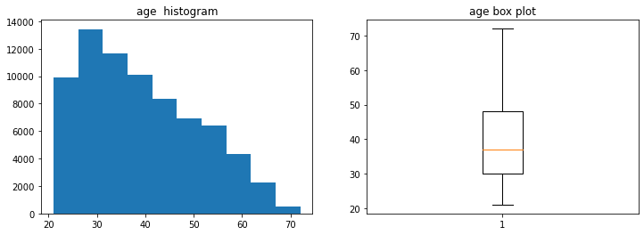
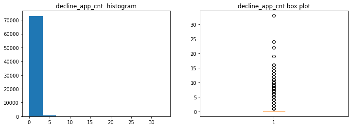
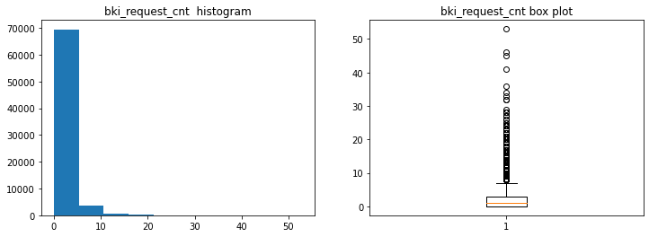
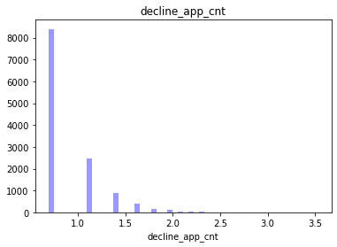
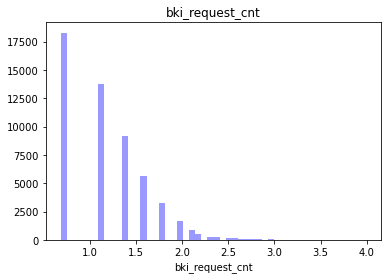
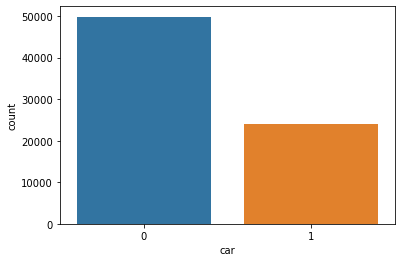
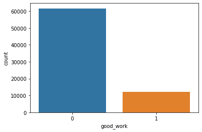

# Project №4: The Computer Says "No"

The aim of the project is to write a scoring model for predicting the default of bank customers.


```python

import numpy as np 
import pandas as pd 

from sklearn.ensemble import GradientBoostingClassifier
from sklearn.ensemble import RandomForestClassifier
from sklearn.feature_selection import SelectKBest, chi2, f_classif, mutual_info_classif
from sklearn.feature_selection import SelectPercentile
from sklearn.feature_selection import SelectFpr, SelectFdr, SelectFwe
from sklearn.feature_selection import GenericUnivariateSelect
from sklearn.feature_selection import SelectFromModel
from sklearn import preprocessing
from sklearn.preprocessing import OneHotEncoder
from sklearn import metrics
from sklearn.metrics import roc_auc_score
from sklearn.metrics import precision_score, recall_score
from sklearn.metrics import f1_score
from sklearn.model_selection import GridSearchCV
from sklearn.feature_extraction import DictVectorizer
from sklearn.feature_extraction.text import CountVectorizer, TfidfVectorizer
from sklearn.ensemble import RandomForestClassifier
from sklearn.svm import SVC
from sklearn.model_selection import train_test_split
from sklearn.metrics import accuracy_score
from sklearn.preprocessing import StandardScaler, LabelEncoder
from sklearn.pipeline import Pipeline
from sklearn.linear_model import LogisticRegression
from sklearn.metrics import confusion_matrix
from sklearn.metrics import f1_score, accuracy_score
import matplotlib.pyplot as plt
import seaborn as sns
import os
for dirname, _, filenames in os.walk('/kaggle/input'):
    for filename in filenames:
        print(os.path.join(dirname, filename))
import datetime 
from datetime import datetime, timedelta
from sklearn.svm import LinearSVC
from sklearn.svm import SVC
import tensorflow as tf
from tensorflow import keras
from tensorflow.keras.layers import Dense
from tensorflow import keras
from tensorflow.keras import layers
from tensorflow.keras.models import Sequential
```


```python
RANDOM_SEED = 42
```

Load train and test datasets


```python
data_train = pd.read_csv('train.csv')
data_test = pd.read_csv('test.csv')
```


```python
data_train.head()
```


<div>
<style scoped>
    .dataframe tbody tr th:only-of-type {
        vertical-align: middle;
    }

    .dataframe tbody tr th {
        vertical-align: top;
    }

    .dataframe thead th {
        text-align: right;
    }
</style>
<table border="1" class="dataframe">
  <thead>
    <tr style="text-align: right;">
      <th></th>
      <th>client_id</th>
      <th>app_date</th>
      <th>education</th>
      <th>sex</th>
      <th>age</th>
      <th>car</th>
      <th>car_type</th>
      <th>decline_app_cnt</th>
      <th>good_work</th>
      <th>score_bki</th>
      <th>bki_request_cnt</th>
      <th>region_rating</th>
      <th>home_address</th>
      <th>work_address</th>
      <th>income</th>
      <th>sna</th>
      <th>first_time</th>
      <th>foreign_passport</th>
      <th>default</th>
    </tr>
  </thead>
  <tbody>
    <tr>
      <th>0</th>
      <td>25905</td>
      <td>01FEB2014</td>
      <td>SCH</td>
      <td>M</td>
      <td>62</td>
      <td>Y</td>
      <td>Y</td>
      <td>0</td>
      <td>0</td>
      <td>-2.008753</td>
      <td>1</td>
      <td>50</td>
      <td>1</td>
      <td>2</td>
      <td>18000</td>
      <td>4</td>
      <td>1</td>
      <td>N</td>
      <td>0</td>
    </tr>
    <tr>
      <th>1</th>
      <td>63161</td>
      <td>12MAR2014</td>
      <td>SCH</td>
      <td>F</td>
      <td>59</td>
      <td>N</td>
      <td>N</td>
      <td>0</td>
      <td>0</td>
      <td>-1.532276</td>
      <td>3</td>
      <td>50</td>
      <td>2</td>
      <td>3</td>
      <td>19000</td>
      <td>4</td>
      <td>1</td>
      <td>N</td>
      <td>0</td>
    </tr>
    <tr>
      <th>2</th>
      <td>25887</td>
      <td>01FEB2014</td>
      <td>SCH</td>
      <td>M</td>
      <td>25</td>
      <td>Y</td>
      <td>N</td>
      <td>2</td>
      <td>0</td>
      <td>-1.408142</td>
      <td>1</td>
      <td>80</td>
      <td>1</td>
      <td>2</td>
      <td>30000</td>
      <td>1</td>
      <td>4</td>
      <td>Y</td>
      <td>0</td>
    </tr>
    <tr>
      <th>3</th>
      <td>16222</td>
      <td>23JAN2014</td>
      <td>SCH</td>
      <td>F</td>
      <td>53</td>
      <td>N</td>
      <td>N</td>
      <td>0</td>
      <td>0</td>
      <td>-2.057471</td>
      <td>2</td>
      <td>50</td>
      <td>2</td>
      <td>3</td>
      <td>10000</td>
      <td>1</td>
      <td>3</td>
      <td>N</td>
      <td>0</td>
    </tr>
    <tr>
      <th>4</th>
      <td>101655</td>
      <td>18APR2014</td>
      <td>GRD</td>
      <td>M</td>
      <td>48</td>
      <td>N</td>
      <td>N</td>
      <td>0</td>
      <td>1</td>
      <td>-1.244723</td>
      <td>1</td>
      <td>60</td>
      <td>2</td>
      <td>3</td>
      <td>30000</td>
      <td>1</td>
      <td>4</td>
      <td>Y</td>
      <td>0</td>
    </tr>
  </tbody>
</table>
</div>


Basic data information:


```python
data_train.info()
```

    <class 'pandas.core.frame.DataFrame'>
    RangeIndex: 73799 entries, 0 to 73798
    Data columns (total 19 columns):
     #   Column            Non-Null Count  Dtype  
    ---  ------            --------------  -----  
     0   client_id         73799 non-null  int64  
     1   app_date          73799 non-null  object 
     2   education         73492 non-null  object 
     3   sex               73799 non-null  object 
     4   age               73799 non-null  int64  
     5   car               73799 non-null  object 
     6   car_type          73799 non-null  object 
     7   decline_app_cnt   73799 non-null  int64  
     8   good_work         73799 non-null  int64  
     9   score_bki         73799 non-null  float64
     10  bki_request_cnt   73799 non-null  int64  
     11  region_rating     73799 non-null  int64  
     12  home_address      73799 non-null  int64  
     13  work_address      73799 non-null  int64  
     14  income            73799 non-null  int64  
     15  sna               73799 non-null  int64  
     16  first_time        73799 non-null  int64  
     17  foreign_passport  73799 non-null  object 
     18  default           73799 non-null  int64  
    dtypes: float64(1), int64(12), object(6)
    memory usage: 10.7+ MB
    

Check the dataset for gaps:


```python
data_train.isnull().sum()
```


    client_id             0
    app_date              0
    education           307
    sex                   0
    age                   0
    car                   0
    car_type              0
    decline_app_cnt       0
    good_work             0
    score_bki             0
    bki_request_cnt       0
    region_rating         0
    home_address          0
    work_address          0
    income                0
    sna                   0
    first_time            0
    foreign_passport      0
    default               0
    dtype: int64


```python
data_test.isnull().sum()
```


    client_id             0
    app_date              0
    education           171
    sex                   0
    age                   0
    car                   0
    car_type              0
    decline_app_cnt       0
    good_work             0
    score_bki             0
    bki_request_cnt       0
    region_rating         0
    home_address          0
    work_address          0
    income                0
    sna                   0
    first_time            0
    foreign_passport      0
    dtype: int64


There are gaps only in the 'education' column. We will return to filling in these gaps later.

### Parsing Data in Columns¶

The 'app_date' column contains date text data. Let's convert them to the datetime type and calculate the time interval between each event and a constant date. Time intervals are converted into numerical form


```python
def datefunc(row):
    da=datetime.strptime(row['app_date'], '%d%b%Y')
    return da
```


```python
data_train['app_date']=data_train.apply(datefunc, axis=1)
data_test['app_date']=data_test.apply(datefunc, axis=1)
```


```python
const_date=datetime(2020,12,31,0,0,0)
```


```python
data_train['timedelta']=const_date-data_train['app_date']
data_train['timedelta']=data_train.apply(lambda x: x['timedelta'].total_seconds()/10000,axis=1)
```


```python
data_test['timedelta']=const_date-data_test['app_date']
data_test['timedelta']=data_test.apply(lambda x: x['timedelta'].total_seconds()/10000,axis=1)
```

Как мы убедились выше столбец data['education'] содержит многочисленные пропуски.
Давайте внимательнее изучим какие ещё значения он содержит


```python
data_train['education'].astype('str').value_counts().plot(kind='bar', grid=True, title= 'Образование клиентов')
```


    <AxesSubplot:title={'center':'Образование клиентов'}>


    

    


We can see that the most popular value in this column is school education. But, since there are also many people with higher education, let's assume that people with higher incomes have higher education. Let's create a function that assigns higher education to people with an income level higher than the third quintile, while the rest have a school education.


```python
from functools import partial

def fill_edu(quan75, row):
    edu=row['education']
    if type(edu) is not str:
        if row['income'] > quan75:
            return 'GRD'
        else:
            return 'SCH'
        
    else:
        return edu
    

```


```python
data_train['education']=data_train.apply(partial(fill_edu, data_train['income'].quantile(0.75)), axis=1)
```


```python
data_test['education']=data_test.apply(partial(fill_edu, data_test['income'].quantile(0.75)), axis=1)
```


```python
data_train.isnull().sum()
```


    client_id           0
    app_date            0
    education           0
    sex                 0
    age                 0
    car                 0
    car_type            0
    decline_app_cnt     0
    good_work           0
    score_bki           0
    bki_request_cnt     0
    region_rating       0
    home_address        0
    work_address        0
    income              0
    sna                 0
    first_time          0
    foreign_passport    0
    default             0
    timedelta           0
    dtype: int64


Grouping data of different types


```python
bin_cols=['sex','car', 'car_type', 'foreign_passport', 'good_work'] #binary data
cat_cols=['education', 'home_address', 'work_address'] # categorical data
num_cols=['age', 'decline_app_cnt', 'income', 'bki_request_cnt', 'timedelta'] # numeric data
time_cols = ['app_date'] # временнЫе
```


```python
def range_outliers(x):
    xmedian=x.median()
    xperc25=x.quantile(0.25)
    xperc75=x.quantile(0.75)
    xIQR=xperc75-xperc25
    print('median:{},'.format(xmedian),'25% percentile:{},'.format(xperc25), '75% percentile:{},'.format(xperc75), 'IQR:{},'.format(xIQR), 'limits of outliers: [{f},{l}]'.format(f=xperc25-1.5*xIQR, l=xperc75+1.5*xIQR))
```

Let's look at the distribution of numerical features:


```python
for i in num_cols:
    
    fig,axes=plt.subplots(1,2, figsize=(12,4))
    
    axes[0].hist(data_train[i])
    axes[0].set_title(i+ '  histogram')
    axes[1].boxplot(data_train[i])
    axes[1].set_title(i+ ' box plot')
    plt.show()
    range_outliers(data_train[i])
```


    

    


    median:37.0, 25% percentile:30.0, 75% percentile:48.0, IQR:18.0, limits of outliers: [3.0,75.0]
    


    

    


    median:0.0, 25% percentile:0.0, 75% percentile:0.0, IQR:0.0, limits of outliers: [0.0,0.0]
    


    

    


    median:30000.0, 25% percentile:20000.0, 75% percentile:48000.0, IQR:28000.0, limits of outliers: [-22000.0,90000.0]
    


    

    


    median:1.0, 25% percentile:0.0, 75% percentile:3.0, IQR:3.0, limits of outliers: [-4.5,7.5]
    


    

    


    median:21548.16, 25% percentile:21314.88, 75% percentile:21798.72, IQR:483.84000000000015, limits of outliers: [20589.120000000003,22524.480000000003]
    

After plotting the histograms, it became obvious that the distributions of all numerical variables, except for 'timedelta', have a heavy right tail. To obtain a more uniform distribution, we take the logarithm of the features. And let's see how the graphs change


```python
for i in num_cols:
    data_train[i] = np.log(data_train[i] + 1)
    plt.figure()
    sns.distplot(data_train[i][data_train[i] > 0].dropna(), kde = False, rug=False, color='b')
    plt.title(i)
    plt.show()
```

    C:\Users\trigu\anaconda3\lib\site-packages\seaborn\distributions.py:2557: FutureWarning: `distplot` is a deprecated function and will be removed in a future version. Please adapt your code to use either `displot` (a figure-level function with similar flexibility) or `histplot` (an axes-level function for histograms).
      warnings.warn(msg, FutureWarning)
    


    

    


    C:\Users\trigu\anaconda3\lib\site-packages\seaborn\distributions.py:2557: FutureWarning: `distplot` is a deprecated function and will be removed in a future version. Please adapt your code to use either `displot` (a figure-level function with similar flexibility) or `histplot` (an axes-level function for histograms).
      warnings.warn(msg, FutureWarning)
    


    

    


    C:\Users\trigu\anaconda3\lib\site-packages\seaborn\distributions.py:2557: FutureWarning: `distplot` is a deprecated function and will be removed in a future version. Please adapt your code to use either `displot` (a figure-level function with similar flexibility) or `histplot` (an axes-level function for histograms).
      warnings.warn(msg, FutureWarning)
    


    

    


    C:\Users\trigu\anaconda3\lib\site-packages\seaborn\distributions.py:2557: FutureWarning: `distplot` is a deprecated function and will be removed in a future version. Please adapt your code to use either `displot` (a figure-level function with similar flexibility) or `histplot` (an axes-level function for histograms).
      warnings.warn(msg, FutureWarning)
    


    

    


    C:\Users\trigu\anaconda3\lib\site-packages\seaborn\distributions.py:2557: FutureWarning: `distplot` is a deprecated function and will be removed in a future version. Please adapt your code to use either `displot` (a figure-level function with similar flexibility) or `histplot` (an axes-level function for histograms).
      warnings.warn(msg, FutureWarning)
    


    

    


```python
data_train.head(3)
```


<div>
<style scoped>
    .dataframe tbody tr th:only-of-type {
        vertical-align: middle;
    }

    .dataframe tbody tr th {
        vertical-align: top;
    }

    .dataframe thead th {
        text-align: right;
    }
</style>
<table border="1" class="dataframe">
  <thead>
    <tr style="text-align: right;">
      <th></th>
      <th>client_id</th>
      <th>app_date</th>
      <th>education</th>
      <th>sex</th>
      <th>age</th>
      <th>car</th>
      <th>car_type</th>
      <th>decline_app_cnt</th>
      <th>good_work</th>
      <th>score_bki</th>
      <th>bki_request_cnt</th>
      <th>region_rating</th>
      <th>home_address</th>
      <th>work_address</th>
      <th>income</th>
      <th>sna</th>
      <th>first_time</th>
      <th>foreign_passport</th>
      <th>default</th>
      <th>timedelta</th>
    </tr>
  </thead>
  <tbody>
    <tr>
      <th>0</th>
      <td>25905</td>
      <td>2014-02-01</td>
      <td>SCH</td>
      <td>M</td>
      <td>4.143135</td>
      <td>Y</td>
      <td>Y</td>
      <td>0.000000</td>
      <td>0</td>
      <td>-2.008753</td>
      <td>0.693147</td>
      <td>50</td>
      <td>1</td>
      <td>2</td>
      <td>9.798183</td>
      <td>4</td>
      <td>1</td>
      <td>N</td>
      <td>0</td>
      <td>9.990445</td>
    </tr>
    <tr>
      <th>1</th>
      <td>63161</td>
      <td>2014-03-12</td>
      <td>SCH</td>
      <td>F</td>
      <td>4.094345</td>
      <td>N</td>
      <td>N</td>
      <td>0.000000</td>
      <td>0</td>
      <td>-1.532276</td>
      <td>1.386294</td>
      <td>50</td>
      <td>2</td>
      <td>3</td>
      <td>9.852247</td>
      <td>4</td>
      <td>1</td>
      <td>N</td>
      <td>0</td>
      <td>9.974879</td>
    </tr>
    <tr>
      <th>2</th>
      <td>25887</td>
      <td>2014-02-01</td>
      <td>SCH</td>
      <td>M</td>
      <td>3.258097</td>
      <td>Y</td>
      <td>N</td>
      <td>1.098612</td>
      <td>0</td>
      <td>-1.408142</td>
      <td>0.693147</td>
      <td>80</td>
      <td>1</td>
      <td>2</td>
      <td>10.308986</td>
      <td>1</td>
      <td>4</td>
      <td>Y</td>
      <td>0</td>
      <td>9.990445</td>
    </tr>
  </tbody>
</table>
</div>


# Correlation of numerical features


```python
correlation=data_train[num_cols].corr()
correlation
```


<div>
<style scoped>
    .dataframe tbody tr th:only-of-type {
        vertical-align: middle;
    }

    .dataframe tbody tr th {
        vertical-align: top;
    }

    .dataframe thead th {
        text-align: right;
    }
</style>
<table border="1" class="dataframe">
  <thead>
    <tr style="text-align: right;">
      <th></th>
      <th>age</th>
      <th>decline_app_cnt</th>
      <th>income</th>
      <th>bki_request_cnt</th>
      <th>timedelta</th>
    </tr>
  </thead>
  <tbody>
    <tr>
      <th>age</th>
      <td>1.000000</td>
      <td>-0.127734</td>
      <td>-0.092586</td>
      <td>0.049327</td>
      <td>-0.017087</td>
    </tr>
    <tr>
      <th>decline_app_cnt</th>
      <td>-0.127734</td>
      <td>1.000000</td>
      <td>-0.013868</td>
      <td>0.125163</td>
      <td>0.022722</td>
    </tr>
    <tr>
      <th>income</th>
      <td>-0.092586</td>
      <td>-0.013868</td>
      <td>1.000000</td>
      <td>0.081019</td>
      <td>-0.005260</td>
    </tr>
    <tr>
      <th>bki_request_cnt</th>
      <td>0.049327</td>
      <td>0.125163</td>
      <td>0.081019</td>
      <td>1.000000</td>
      <td>0.009672</td>
    </tr>
    <tr>
      <th>timedelta</th>
      <td>-0.017087</td>
      <td>0.022722</td>
      <td>-0.005260</td>
      <td>0.009672</td>
      <td>1.000000</td>
    </tr>
  </tbody>
</table>
</div>


```python
sns.heatmap(correlation)
```


    <AxesSubplot:>


    

    


We see only a weak correlation between 'decline_app_cnt' and 'bki_request_cnt'. For further evaluation, we will check the significance of these features.

### Binary features

Let's convert the values of binary features to zeros and ones


```python
label_encoder = LabelEncoder()
for column in bin_cols:
    data_train[column] = label_encoder.fit_transform(data_train[column])
    data_test[column] = label_encoder.fit_transform(data_test[column])
```

The distribution of values in binary features


```python
for column in data_train[bin_cols]:
    bin_cal_val=data_train[column].value_counts()
    #bin_cal_val.plot(kind='bar', title=column)
    sns.countplot(x=data_train[column], data=data_train[bin_cols])
    plt.show()
```


    

    


    

    


    

    


    

    


    

    


### Categorical Features


```python
oh_encoder=OneHotEncoder(sparse=False)
X_cat = pd.DataFrame(oh_encoder.fit_transform(data_train[cat_cols].values))
X_cat_test = pd.DataFrame(oh_encoder.fit_transform(data_test[cat_cols].values))
```


```python
cat_col_names = oh_encoder.get_feature_names()
cat_col_names = cat_col_names.tolist()
```

### Let's combine the prepared data into one set


```python
X=np.hstack([data_train[num_cols], data_train[bin_cols].values, X_cat])
X_Test = np.hstack([data_test[num_cols], data_test[bin_cols].values, X_cat_test])
y=data_train['default'].values
```

### Standardizing features


```python
X =StandardScaler().fit_transform(X)
X_Test =StandardScaler().fit_transform(X_Test)
```

### Assessment of the significance of features

To assess the significance of numerical variables, we will use the f_classif function from the sklearn library.


```python
col_names = num_cols + bin_cols + cat_col_names
```


```python
X_df = pd.DataFrame(X, columns = col_names )
X_Test_df = pd.DataFrame(X_Test, columns = col_names ) 
```


```python
f_classif(X_df, y)
```


    (array([  50.3805738 , 1152.93731744,  214.79052738,  457.59176046,
             115.02245779,   28.41465738,  137.73286531,  244.66329744,
             329.96184694,  139.01130278,   12.90457444,  428.27367014,
              45.16139373,  417.43376759,    2.092296  ,  617.00462595,
             628.13675939,    1.38067054,  237.35378196,  153.89567255,
             458.85750261]),
     array([1.27778005e-012, 8.96214001e-251, 1.44923018e-048, 3.26668128e-101,
            8.14373905e-027, 9.82078995e-008, 8.89796288e-032, 4.64013412e-055,
            1.41830731e-073, 4.67979108e-032, 3.27992997e-004, 7.18943232e-095,
            1.82759849e-011, 1.59458636e-092, 1.48047678e-001, 1.21350806e-135,
            4.82075470e-138, 2.39990755e-001, 1.79935229e-053, 2.64713467e-035,
            1.73922960e-101]))


```python
imp = pd.Series(f_classif(X_df, y)[0], index = X_df.columns)
imp.sort_values(inplace = True)
imp.plot(kind = 'barh', title='significance of numerical features')

```


    <AxesSubplot:title={'center':'significance of numerical features'}>


    

    


'decline_app_cnt' is the most significant attribute

Let's drop columns with have not any influence


```python
X = X_df.drop(['x1_3', 'x0_UGR'], axis=1)
X_Test = X_Test_df.drop(['x1_3', 'x0_UGR'], axis=1)
```

### Divide the sample into training and test 


```python
X_train, X_test, y_train, y_test = train_test_split(X, y, test_size=0.2, random_state=RANDOM_SEED)
```

Let's write a function for training and testing a model that returns the completed model


```python
def trait_regressor(X_train, y_train, X_test, y_test, model):
    model.fit(X_train, y_train)
    y_pred = model.predict(X_test)
    
    print('Accuracy:'+str(accuracy_score(y_test, y_pred)))
    print('Precision:'+str(precision_score(y_test, y_pred)))
    print('Recall:'+str(recall_score(y_test, y_pred)))
    print('f1: ' + str(f1_score(y_test, y_pred)))
    
    fig = plt.figure(figsize=(6, 6))
    cm1 = confusion_matrix(y_test, y_pred)
    sns.heatmap(cm1, annot = True)
    plt.xlabel('Predicted')
    plt.ylabel('Actual')
    cm1
    
    return model
```

Let's start with logistic regression


```python
lr = trait_regressor(X_train, y_train, X_test, y_test, LogisticRegression(max_iter=1000, random_state = RANDOM_SEED))
```

    Accuracy:0.8760840108401085
    Precision:0.4375
    Recall:0.0038314176245210726
    f1: 0.00759631036353771
    


    

    


```python
rf = trait_regressor(X_train, y_train, X_test, y_test,
                            RandomForestClassifier(random_state = RANDOM_SEED)
                       )
```

    Accuracy:0.8710027100271003
    Precision:0.3005181347150259
    Recall:0.031746031746031744
    f1: 0.05742574257425742
    


    

    


```python
svc = trait_regressor(X_train, y_train, X_test, y_test,
                            SVC(random_state = RANDOM_SEED)
                       )
```

    Accuracy:0.876219512195122
    Precision:0.0
    Recall:0.0
    f1: 0.0
    

    C:\Users\trigu\anaconda3\lib\site-packages\sklearn\metrics\_classification.py:1245: UndefinedMetricWarning: Precision is ill-defined and being set to 0.0 due to no predicted samples. Use `zero_division` parameter to control this behavior.
      _warn_prf(average, modifier, msg_start, len(result))
    


    

    


Let's try to find the optimal hyperparameters for GradientBoostingClassifier using GridSearchCV


```python
gb = trait_regressor(X_train, y_train, X_test, y_test,
                            GradientBoostingClassifier(random_state = RANDOM_SEED)
                       )
```

    Accuracy:0.8756775067750677
    Precision:0.16666666666666666
    Recall:0.0010946907498631637
    f1: 0.0021750951604132683
    


    

    


```python
# {'max_depth': 6, 'n_estimators': 500}
param_grid = {
    'n_estimators': [200, 500],
    'max_features': ['auto', 'sqrt', 'log2'],
    'max_depth' : [3, 4, 6]
}
gb_best = trait_regressor( X_train, y_train, X_test, y_test,
                       GridSearchCV(estimator = GradientBoostingClassifier(), param_grid = param_grid, n_jobs = 6)
                       )

```

    Accuracy:0.8753387533875339
    Precision:0.25925925925925924
    Recall:0.0038314176245210726
    f1: 0.0075512405609493
    


    

    


The best results were shown by the GradientBoostingClassifier model


```python

```
